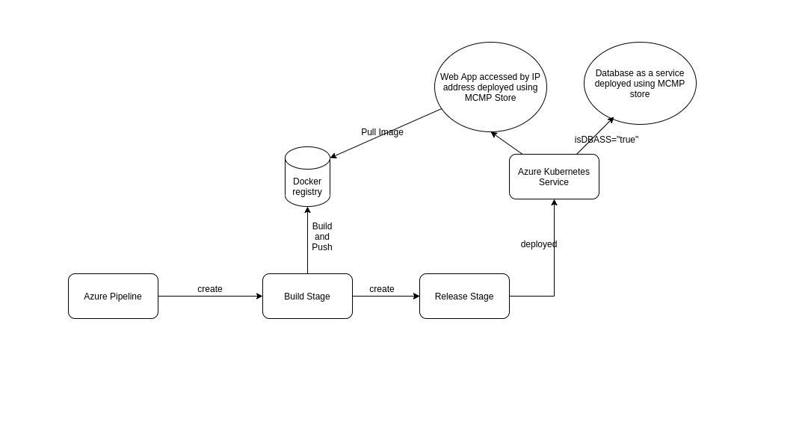

# Modernize and Extend: JPetStore on IBM Cloud Kubernetes Service

This demo modernizes an existing Java web application (JPetStore) by:

1. building Docker containers from the legacy stack.
2. moving the app to Azure Kubernetes Service.



[](https://youtu.be/26RjSa0UZp0 "Containerized Applications with IBM Cloud Kubernetes")

## Before you begin

Follow the below steps to create resources used in this demo. You will create a Kubernetes cluster.

1. Create azure database for mysql servers and note down username, servername and password.[](https://docs.microsoft.com/en-us/azure/mysql/quickstart-create-mysql-server-database-using-azure-portal)
2. Create kubernetes service from MCMP Store or from azure portal[](https://docs.microsoft.com/en-us/azure/aks/kubernetes-walkthrough).
3. Follow the instructions in the **Access** tab of your cluster to gain access to your cluster using [**kubectl**](https://kubernetes.io/docs/reference/kubectl/overview/).
## Manual deployment.

To manually deploy the demo, follow the below steps.

### Clone the demo to your laptop

Clone the demo repository:

```bash
git clone https://github.ibm.com/mcmp-demo/jpetstore-kubernetes.git
cd jpetstore-kubernetes
```

#### Code structure

| Folder | Description |
| ---- | ----------- |
|[**jpetstore**](/jpetstore)| Traditional Java JPetStore application |
|[**helm**](/helm)| Helm charts for templated Kubernetes deployments |
|[**pet-images**](/pet-images)| Pet images (which can be used for the demo) |

### Create Kubernetes secrets

Next, use the `kubectl` command to allow your Kubernetes cluster access to the secrets you just created.

Encode mysql server secrets using base64, put the same in secrets.yaml file and run the following command.

```bash
   cd jpetstore
   kubectl apply -f secrets.yaml
```

## Build and push the container images

The docker images for each of the micro-services need to be built and then pushed to a container registry. Here are the steps for pushing to your private registry, but be aware that you could also push them to a public registry.

1. Add secrets related to repository into values.yaml

2. Build and push **jpetstoredb** image. Run these commands as they are.

   ```bash
   # from the jpetstore-kubernetes directory
   cd db
   docker build . -t ${MYREGISTRY}/${MYNAMESPACE}/jpetstoredb
   docker push ${MYREGISTRY}/${MYNAMESPACE}/jpetstoredb
   ```

3. Build and push the **jpetstoreweb** image. Run these commands as they are. You do not need to replace any of the values belwo:

   ```bash
   # from the jpetstore-kubernetes directory
   cd jpetstore
   docker build . -t ${MYREGISTRY}/${MYNAMESPACE}/jpetstoreweb
   docker push ${MYREGISTRY}/${MYNAMESPACE}/jpetstoreweb
   ```
5. Finally make sure that both images have been successfully pushed to the container registry.

## Deploy the application

There are two different ways to deploy the three micro-services to a Kubernetes cluster:

- Using [Helm](https://helm.sh/) to provide values for templated charts (recommended)
- Or, updating yaml files with the right values and then running  `kubectl create`

### Option 1: Deploy using YAML files

For this option, you need to update the YAML files to point to your registry namespace.

1. `kubectl apply -f mysqlJob.yaml`   - This creates predefined schema into mysql database.
2. `kubectl create -f jpetstore.yaml`  - This creates the JPetstore app microservice


Copy the external ip under jpetstore service and try to open it in browser.
## You're Done!

You are now ready to use the UI to shop for a pet or query the store by sending it a picture of what you're looking at:

1. Access the java jpetstore application web UI for JPetstore using IP provided by `kubectl get svc -n <namespace>`

   

## Clean up:

```bash
# Use "helm delete" to delete the two apps
kubectl delete -f jpetstore.yaml

# Delete the secrets stored in our cluster
kubectl delete secret mysql-creds
  


```
