# CI/CD Configuration
## Pre-requisites

This setup assumes that you have ordered a Petstore Service Instance.

### Generate a System User ID and System User API Key

1. Open the left menu. Then press the `User Access` tab. Once the page has loaded, go to `System User`.
   
   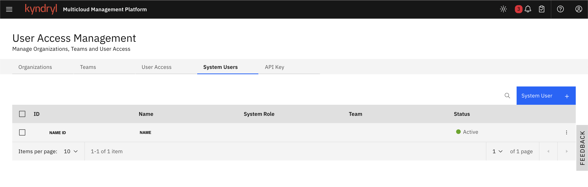

2. Press the blue button shown on the screen `System User +` to add a new System User.
3. Create a new `System User` with the right privileges.

   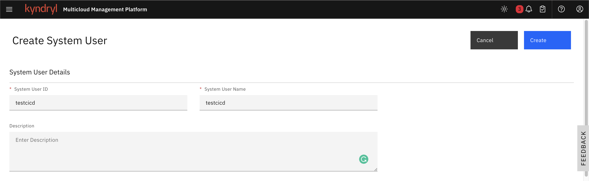

   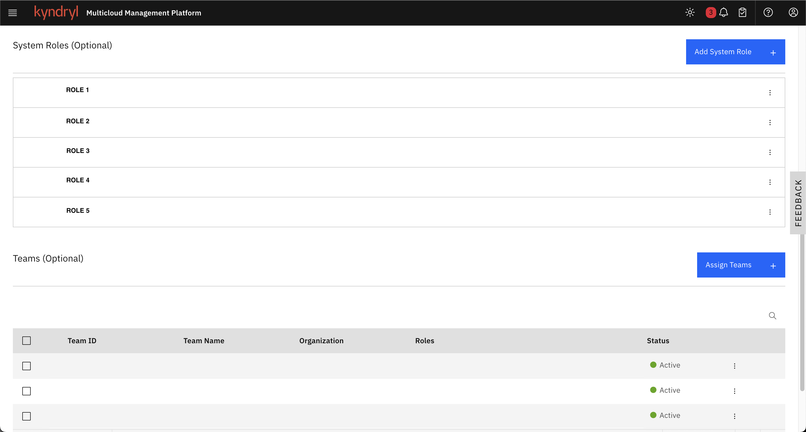

4. Finally, press `Create`. The result will look like this:
   
   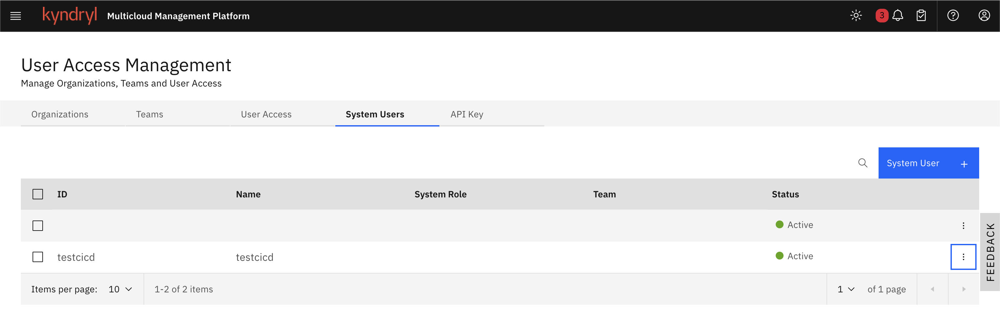

5. Generate a `Token API Key` for the `System User` already created and save this token along with the `System User ID`.

   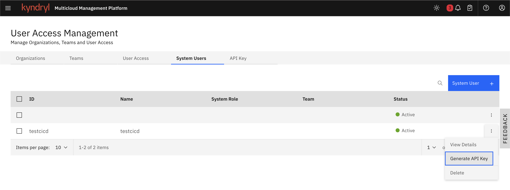

### Generate a Bearer Token

1. Go to the `profile icon` shown on the navigation-bar and press `Developer Console`.

   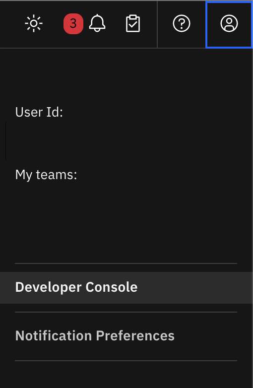

2. Once there, go to the tab called `Bearer Token` and press the `Display` button. 

   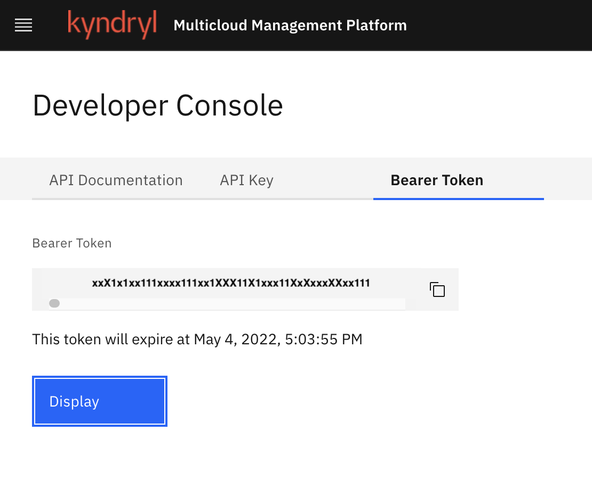

   Note: This token will expire each hour.

3. Store this value in a secure place, this only will be shown once.

### Get the Order ID

1. Open the left menu and go to `Ordered Services`. Then, look up for the created service of `Petstore` and view the details of the service.
   
   

2. Once in the details view, change to the `Order History` tab and there you'll get your `Order Id`.

   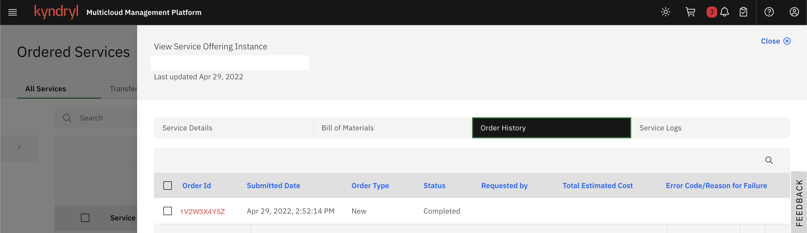

3. Save the `Order Id` number, it will be used later.

### Get the Tenant URL

1. Go to the main dashboard of your tenant and right-click on the button called `Kyndryl Multicloud Management Platform`. Then select the option `copy link address`, this action will save the tenant URL into your clipboard. Paste this into a file, this URL will be used later.
   
   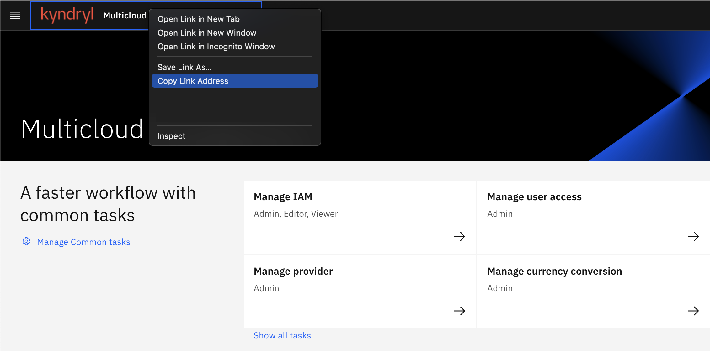

## Jenkins

1. Fork the [JPetstore-Kubernetes](https://github.com/mcmpdemoeng/jpetstore-kubernetes) project to your own Github Account. Generate a `Github Access Token` within `Profile` > `Settings` > `Developer Settings` > `Personal Access Token`. Once you are at that [page](https://github.com/settings/apps), create your token and save it.

   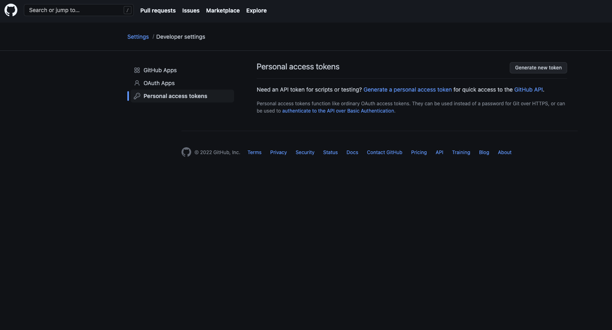

2. Go to the main Democloud's Jenkins [page](http://13.82.103.214:8080/), access with the given username and password. You will see a dashboard like this:

   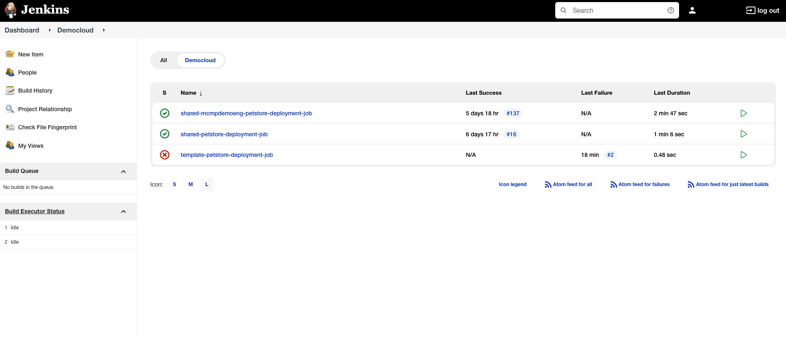

3. Select the tab of `Democloud` and select the `template-petstore-deployment-job`. Direct to `Build with parameters` and provide all the parameters created early.

   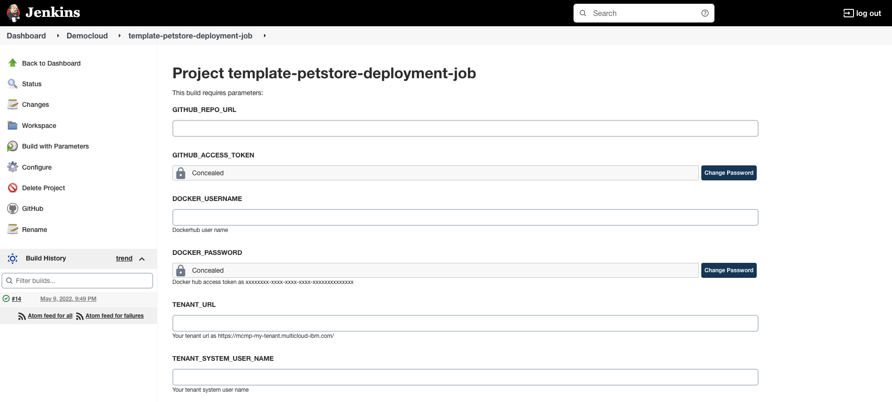

   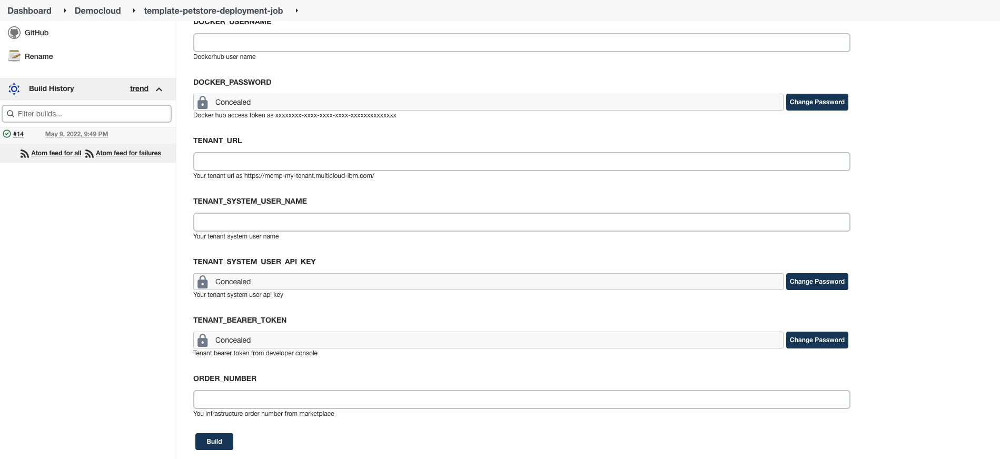

4. Once all the parameters are filled, press the `build` button located at the bottom of the page. If the pipeline was succeeded you'll be able to see a green check with a specific number within the `Build History`. Select the succeeded pipeline and go to `Console Output`.

   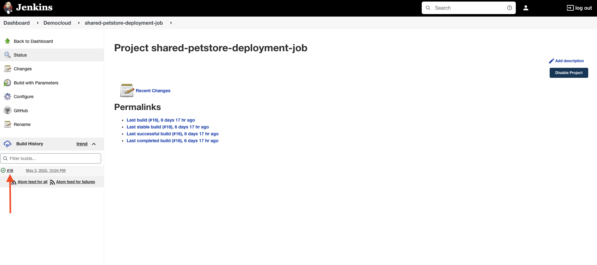

   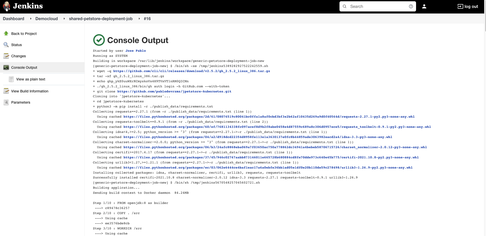

5. Look up within the output for a text with this format `Your application is available at http://<url_to_your_application>`. Copy the URL and paste it into your browser to see your Petstore application deployed on AKS.
## Github Actions

1. Fork the [JPetstore-Kubernetes](https://github.com/mcmpdemoeng/jpetstore-kubernetes) project to your own Github Account. Then, go to `Github Actions` of the current project and set up the information.
   
   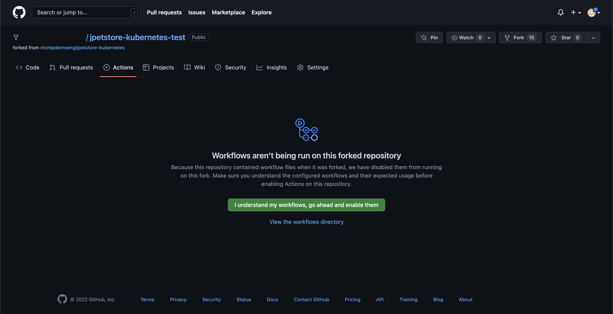

2. Now in the current repository, go to `Settings` > `Secrets` > `Actions`. Create the following `repository secrets`:
   
   - `GH_TOKEN`: A Github access token.
   - `BEARER_TOKEN`: The bearer token created in the developer console of your tenant.
   - `DOCKER_PASSWORD`: Your personal Docker password or a created access token with Read/Write/Delete privileges.
   - `DOCKER_USERNAME`: Your personal Docker username.
   - `ORDER_NUMBER`: The order id of your created service.
   - `TENANT_SYSTEM_USER_API_KEY`: The system user generated api key.
   - `TENANT_SYSTEM_USER_NAME`: The system user id of your tenant.
   - `TENANT_URL`: The URL of your tenant.

   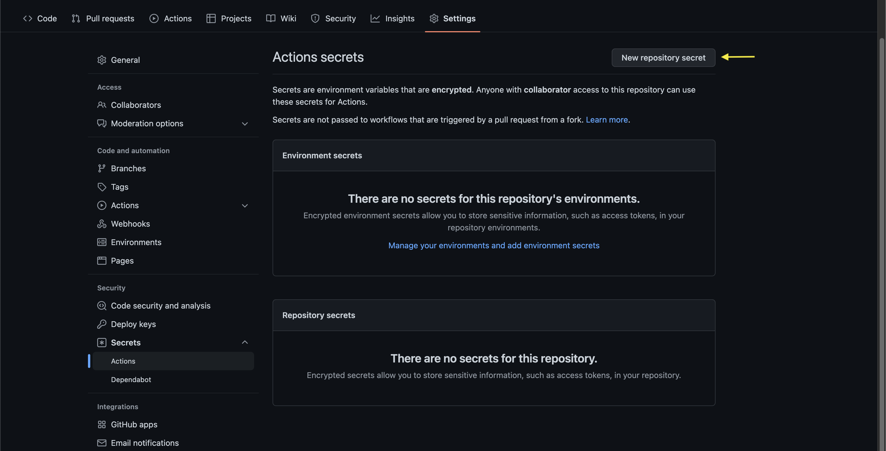

   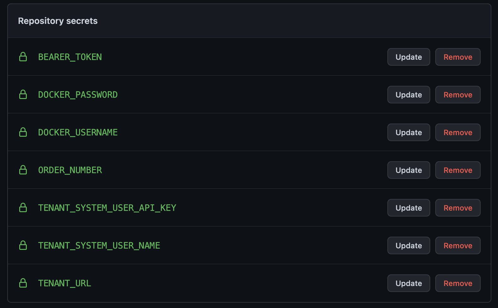

3. After the set up of `Actions`, go back to `Github Actions Tab` a created workflow will appear in your workflows tab. Select the one that is already there called `CI/CD Pipeline`.

   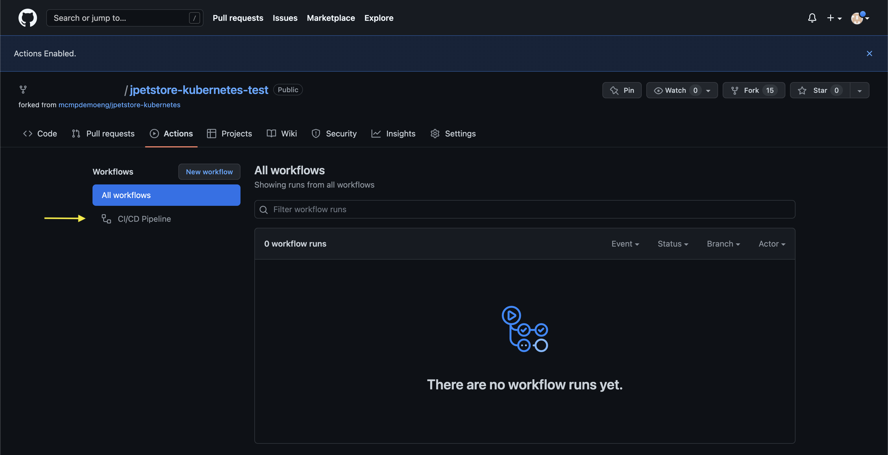

4. Run the selected workflow with the `Run workflow` button and wait for the worker to be done.

   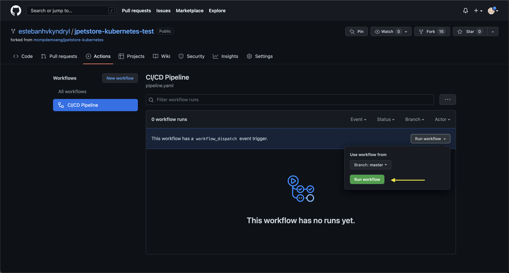

5. Once the worker has been done and succeeded, get into the ran pipeline and select the stage of `AKS Deployment & IBM DevOps Intelligence`. Then, select the `Deploy into AKS` job and, at the end of the logs, you'll see the URL of your deployed app.

   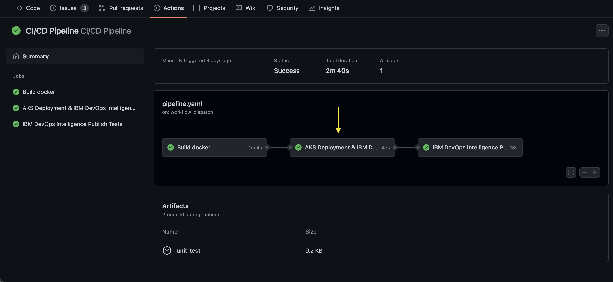

   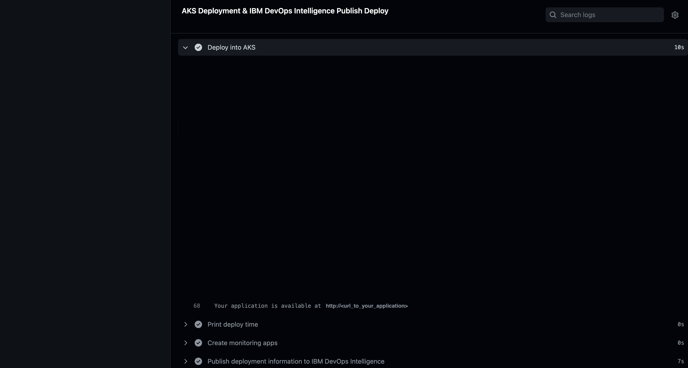

6. Copy the URL and paste it into your browser to see your Petstore application deployed on AKS.